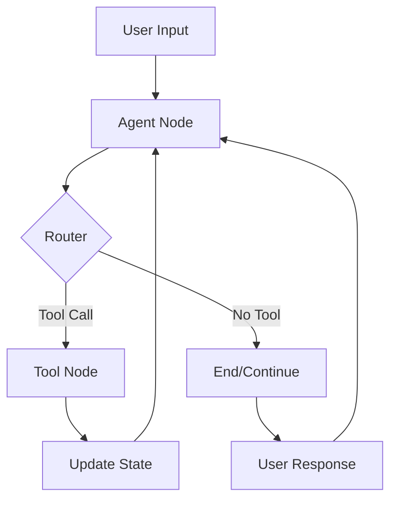

# CareerForge: AI-Powered Project & Career Co-Pilot

[](https://www.python.org/downloads/)
[](https://python-poetry.org/)
[](https://langchain-ai.github.io/langgraph/)
[](https://ai.google.dev/)

CareerForge is an advanced, conversational AI assistant designed to help users plan, manage, and execute their professional and personal projects. It leverages a hierarchical, stateful agentic system built with LangGraph and powered by Google's Gemini models to provide an interactive and intelligent project management experience.

## 🚀 Core Features

### 💬 **Conversational Idea Refinement**
Engage in natural conversation to flesh out and clarify initial project ideas. The AI helps you think through requirements, constraints, and goals.

### 🗂️ **Structured Plan Generation**
Automatically transform refined ideas into structured, actionable Kanban-style project plans with detailed tasks, descriptions, and statuses.

### ✏️ **Interactive Plan Modification**
- Add new tasks to existing plans
- Modify task descriptions and priorities
- Remove or reorganize project components
- All through natural conversation

### 💾 **Persistent State Management**
- Save project plans to JSON files
- Load and continue work on previous projects
- Maintain conversation context throughout sessions

### 🔮 **Future Enhancements**
- Web-powered insights with Google Cloud Vertex AI Search
- Real-time career and skills advice
- Integration with popular project management tools

## 🛠️ Architecture Overview

CareerForge is built around a sophisticated stateful agent system using LangGraph:



### Core Components

#### 🧠 **Agent Node** - The Decision Maker
- Processes user input and conversation context
- Uses Google Gemini to understand intent
- Decides which tools to invoke based on current state
- Maintains awareness of project plan status

#### 🔧 **Custom Tool Node** - The Action Executor
- **Project Scoping Tool**: Converts ideas into structured plans
- **Task Management Tool**: Adds/modifies tasks in existing plans  
- **File Operations Tool**: Saves and loads project plans
- **State Management**: Directly modifies the agent's persistent state

#### 🔄 **Stateful Loop System**
- Continuous conversation flow with persistent memory
- Dynamic routing based on conversation context
- Automatic state updates after each interaction
- Graceful session termination on save operations

## 💻 Tech Stack

| Component | Technology | Purpose |
|-----------|------------|---------|
| **Runtime** | Python 3.12+ | Core application runtime |
| **Dependency Management** | Poetry | Package and environment management |
| **Agent Framework** | LangGraph | State-based agent orchestration |
| **LLM Provider** | Google Gemini | Natural language processing |
| **Data Validation** | Pydantic | Schema validation and serialization |
| **Environment Config** | python-dotenv | Environment variable management |

## 🚀 Getting Started

### Prerequisites
- Python 3.12 or higher
- Poetry (for dependency management)
- Google AI API key

### Installation

1. **Clone the repository**
   ```bash
   git clone https://github.com/yourusername/careerforge.git
   cd careerforge
   ```

2. **Install dependencies**
   ```bash
   poetry install
   ```

3. **Set up environment variables**
   ```bash
   cp .env.example .env
   # Edit .env and add your Google AI API key
   GEMINI_KEY=your_google_ai_api_key_here
   ```

4. **Activate the virtual environment**
   ```bash
   poetry shell
   ```

### Usage

Start the interactive session:
```bash
python -m src.main_agent
```

#### Example Workflow

```
🤖 Hello! I'm your Interactive Project Manager. Let's start a new project.
👤 You: I want to build a personal finance tracker app

🤖 AI: I'll help you create a comprehensive plan for your personal finance tracker app!
--- 🛠️ Calling Project Scoping Tool ---
🤖 Thinking and generating your project plan...

⚙️ Tool Result: Successfully generated a plan for 'Personal Finance Tracker App' with 8 tasks.

🤖 AI: Great! I've created a detailed project plan with the following tasks:
- Setup Development Environment
- Design Database Schema
- Implement User Authentication
- Create Transaction Management
- Build Dashboard and Analytics
- Add Budget Planning Features
- Implement Data Export
- Testing and Deployment

Would you like me to add any additional features or modify existing tasks?

👤 You: Add a mobile app version task
🤖 AI: I'll add a mobile app development task to your plan.
⚙️ Tool Result: Successfully added task 'Mobile App Development' to the plan.

👤 You: Perfect! Save this as my_finance_app
⚙️ Tool Result: ✅ Project plan successfully saved to my_finance_app.json! Session will now end.
🎉 Project planning session completed!
```

## 📁 Project Structure

```
careerforge/
├── src/
│   ├── agents/
│   │   └── generate_plan.py     # Core plan generation logic
│   ├── schemas.py               # Pydantic data models
│   └── main_agent.py           # Main agent orchestration
├── pyproject.toml              # Poetry dependencies
├── .env.example                # Environment variables template
└── README.md                   # This file
```

## 🔧 Configuration

### Environment Variables
```bash
GEMINI_KEY=your_google_ai_api_key_here
```

### Schema Customization
Modify `src/schemas.py` to customize the project plan structure:

```python
class KanbanTask(BaseModel):
    id: int = Field(..., description="Unique ID for the task")
    title: str = Field(..., description="Task title")
    description: str = Field(..., description="Task description")
    status: Literal["To-Do"] = Field(default="To-Do")

class ProjectPlan(BaseModel):
    project_title: str = Field(..., description="Project title")
    project_description: str = Field(..., description="Project summary")
    tasks: List[KanbanTask] = Field(..., description="Project tasks")
```

## 🎯 Use Cases

- **Software Development Projects**: Break down app ideas into actionable development tasks
- **Career Planning**: Create structured plans for skill development and career transitions
- **Personal Projects**: Organize creative projects, learning goals, or home improvements
- **Business Planning**: Structure startup ideas or business process improvements
- **Research Projects**: Plan academic or professional research initiatives

## 🤝 Contributing

1. Fork the repository
2. Create a feature branch (`git checkout -b feature/amazing-feature`)
3. Commit your changes (`git commit -m 'Add some amazing feature'`)
4. Push to the branch (`git push origin feature/amazing-feature`)
5. Open a Pull Request

## 📄 License

This project is licensed under the MIT License - see the [LICENSE](LICENSE) file for details.

## 🙏 Acknowledgments

- [LangGraph](https://langchain-ai.github.io/langgraph/) for the agent framework
- [Google AI](https://ai.google.dev/) for the Gemini models
- [Pydantic](https://pydantic.dev/) for data validation
- The open-source community for inspiration and tools

**Happy Planning! 🚀**